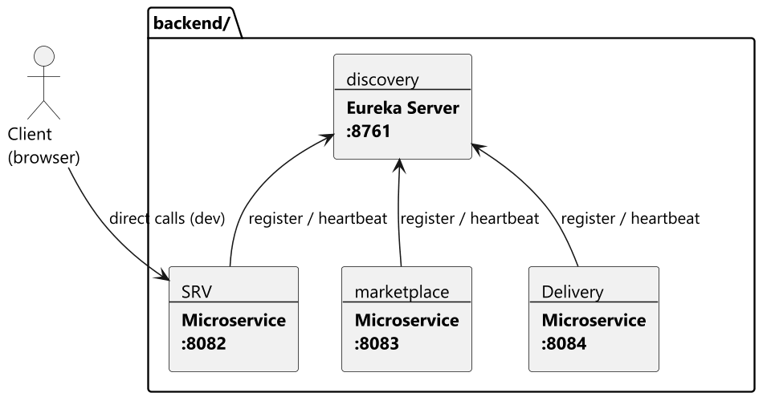

# EspritMarket – Microservices

**Projet : PIDEV 4SE1 (2025–2026)** — ESPRIT
Structure basée sur les workshops **Applications Web Distribuées (AWD)**

---

## Présentation du projet

**EspritMarket** est une place de marché de services dédiée à la communauté ESPRIT.
Les étudiants peuvent y proposer, découvrir et réserver des services entre pairs :

- **SRV** — offres de services : publication, réservation (booking), suivi des
  réalisations et livraison des livrables ; c'est le module en cours de développement
- **Marketplace, événementiel, partenariats** — autres domaines du projet

L'ensemble est construit en **architecture microservices** : chaque domaine est un
service Spring Boot indépendant, enregistré dans un registre **Eureka**.

---

## Architecture



> Source : [`documentation/diag/architecture.puml`](documentation/diag/architecture.puml)

| Service | Dossier | Port | Rôle |
|---------|---------|------|------|
| discovery | `backend/discovery/` | 8761 | Eureka Server — registre de services |
| SRV | `backend/microservices/SRV/` | 8082 | Microservice services/réservations, client Eureka |
| marketplace | `backend/microservices/marketplace/` | 8083 | Microservice marketplace, client Eureka |
| Delivery | `backend/microservices/Delivery/` | 8084 | Microservice livraison (JPA + PostgreSQL), client Eureka |

---

## Technologies utilisées

- Java 17
- Spring Boot
- Spring Cloud Netflix Eureka (server + client)
- Maven
- IntelliJ IDEA

---

## Démarrage

**Ordre important :** toujours démarrer le serveur Eureka avant les microservices.

```powershell
# Terminal 1 — Eureka Server sur :8761
cd backend/discovery
.\mvnw.cmd spring-boot:run

# Terminal 2 — SRV sur :8082
cd backend\microservices\SRV
.\mvnw.cmd spring-boot:run

# Terminal 3 — marketplace sur :8083
cd backend\microservices\marketplace
.\mvnw.cmd spring-boot:run

# Terminal 4 — Delivery sur :8084
cd backend\microservices\Delivery
.\mvnw.cmd spring-boot:run
```

Vérification : ouvrir <http://localhost:8761> → les services (`SRV`, `marketplace`,
`Delivery`) doivent apparaître dans *Instances currently registered with Eureka*.
